# Results

**Each window of data came from one of `K` unknown closed-form laws; recover
the law each window came from.** This page is the scorecard: fifteen
missions, what each asked, what came out, and a verdict. The method and the
arguments are in the [README](README.md); every number here is generated from
`results/` by `python -m analysis.results`, so it cannot drift from the runs.

The protocol behind every number: tune on seeds {3, 7, 19}, report on
{11, 23, 42}; true labels reach the final metric only; a prediction is
declared before the run that tests it; negatives are reported.

## Scorecard

| # | mission | verdict | the result in one line |
|---|---|---|---|
| 1 | [Is there a ceiling?](#1-the-ceiling-is-a-formula) | **holds** | `Q(sqrt(n rho)/2)`, exact in 18 cells; unchanged by a shared component in 6/6 |
| 2 | [Can it be reached without labels?](#2-mechanism-space-reaches-it) | **holds** | K-means in mechanism space: median 0.0022 from the oracle |
| 3 | [What is the loop for?](#3-the-loop-is-a-stabiliser) | **holds** (not as hoped) | a contraction: error out 0.051-0.052 whatever goes in |
| 4 | [Which problems does it solve?](#4-the-problem-zoo) | **holds, one failure** | 28/36 cells within 0.02 of the oracle; the gap outside the library fails |
| 5 | [Which loss?](#5-losses-v8) | **holds** | a loss costs its efficiency; the learned loss is within 0.002 of Bayes |
| 6 | [Real time?](#6-real-time-v9) | **holds** | detection delay predicted to a median 2.5% |
| 7 | [Real data, whole days](#7-real-data-whole-days) | **partly** | ARI 0.93, but a raw-profile K-means ties it |
| 8 | [Days with sensor gaps](#8-days-with-sensor-gaps) | **holds** (small sample) | 38 days with 6-11 hours: law 1.000, imputation 0.868 / 0.711 |
| 9 | [A partial day's error (V11)](#9-a-partial-days-error-v11) | **partly** | ranks which hours matter; the level only within a factor of a few |
| 10 | [A kernel basis](#10-a-kernel-basis) | **partly** | the failure of mission 4 cut by 47%; the rank rule did not replicate |
| 11 | [Classification: V10](#11-classification-v10) | **holds** | the learning curve, exact: 58/60 fixed-design and 60/60 random-design cells |
| 12 | [24 real classification tasks](#12-24-ucr-datasets) | **partly** | beats raw 1-NN on 11/15 shape and 5/9 daily sets; loses to tuned raw classifiers |
| 13 | [Repairs](#13-repairs) | **partly** | GunPoint 0.087 -> 0.027 with a warp; a stack closes part of mission 12's gap |
| 14 | [Streaming with gaps](#14-streaming-with-gaps) | **holds** | 573 partial days streamed at 96.3%; a kernel sees a newcomer the library cannot |
| 15 | [Wind power curves](#15-wind-power-curves) | **partly** | laws beat the method of bins by 0.046 and 0.053; one declared prediction held, one failed |

---

## 1. The ceiling is a formula

An oracle that knows both laws errs at `P_err = Q(sqrt(n rho)/2)` (`rho` the
separation between the laws in noise units, `n` the window length). The
identity is exact, not asymptotic, in 18 cells, and a component both laws
share, scaled to 50x the gap, leaves the error unchanged in
6/6.

## 2. Mechanism space reaches it

Profile out the nuisance, subtract the shared law, whiten, project: windows
become an isotropic Gaussian mixture with centres `sqrt(n rho)` apart, where
plain K-means is the right rule. Over 72 cells its median gap to the
oracle is 0.0022. On the pair battery, where the geometry carries nothing:
oracle 0.033, LR-DSR 0.038, mechanism K-means 0.034, best clustering
of window summaries 0.144.

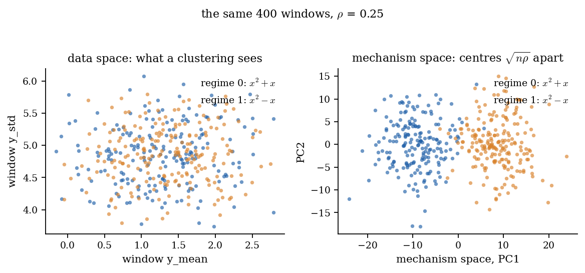
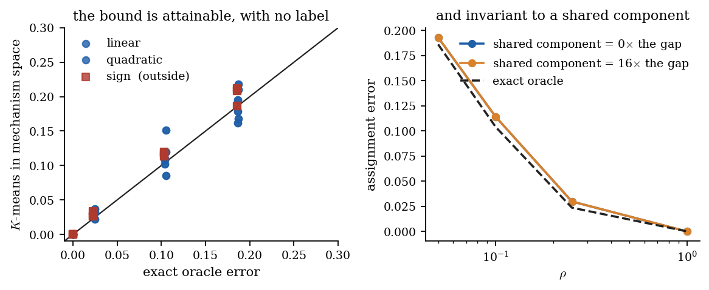

## 3. The loop is a stabiliser

The alternating fit-and-reassign loop does not beat its initialiser. Handed
starts of controlled quality -- error in from 0.044 to 0.277 -- it returns
0.051 to 0.052: a contraction onto a fixed point. It repairs a bad
start (+0.225 from chance) and slightly damages a perfect one
(-0.007).

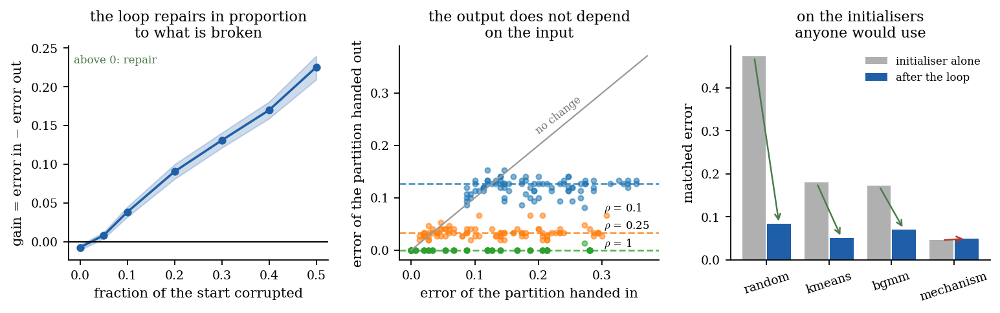

## 4. The problem zoo

Twelve problems, each built to break one assumption. Mean gap to the oracle:
soft EM +0.018, mechanism K-means +0.017, raw-profile K-means +0.130,
window summaries +0.221. Laws outside the symbolic library are harmless
when the *gap* is inside its span (5 problems, +0.006). The failure is
`high_frequency`, whose gap is 37% outside the span (+0.096 for soft EM) --
mission 10's target.

## 5. Losses (V8)

A loss costs exactly its efficiency: `P_err = Q(sqrt(n rho eta)/2)`, in band in
56/56 cells at small per-sample gaps. Under 10% contamination the best
loss is 9.0 times as efficient as the squared loss -- the squared loss needs
that many times the samples -- and Huber recovers 7.5 of it. A **learned**
loss -- the noise model refitted every iteration -- is within
0.002 of the true-noise Bayes rule under all four noise laws; a soft EM
that *assumes* Gaussian noise collapses under heavy tails
(0.362 under Student-t(3)).

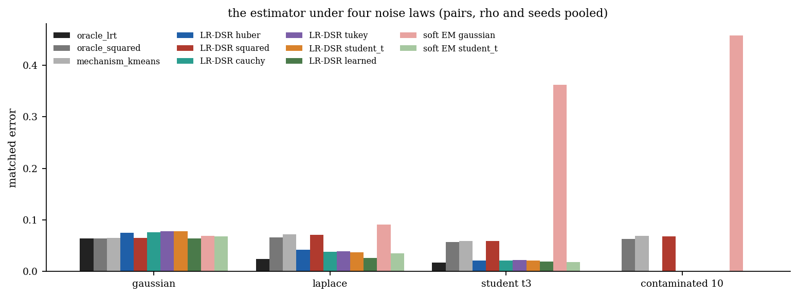

## 6. Real time (V9)

The per-sample KL divergence between two laws is `rho/2`, so CUSUM's delay is
a formula: predicted to a median 2.5% (worst 7.9%), and the
`e^h` false-alarm bound holds in 20/20 cells. The online clusterer
matches batch-in-hindsight with enough history, gives birth to new regimes
3-9 windows after they appear, with no false births, at
342-646 us per window.

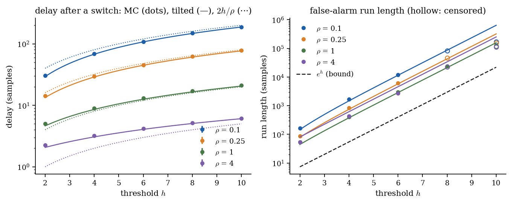

## 7. Real data, whole days

Bike sharing (DC) and I-94 traffic (Minneapolis), one window per day, scored
against the calendar as a proxy. Against the calendar the laws reach ARI
0.955 (bike) and 0.927 (traffic), and the days they disagree on are
mostly days the calendar mislabels. **But K-means on the raw 24-hour profile
ties** (0.955, 0.927): with one shared design, mechanism space is a
linear change of coordinates of the profile. Choosing `K` by BIC does not
work on this data. In real time: 97.2% of traffic days.

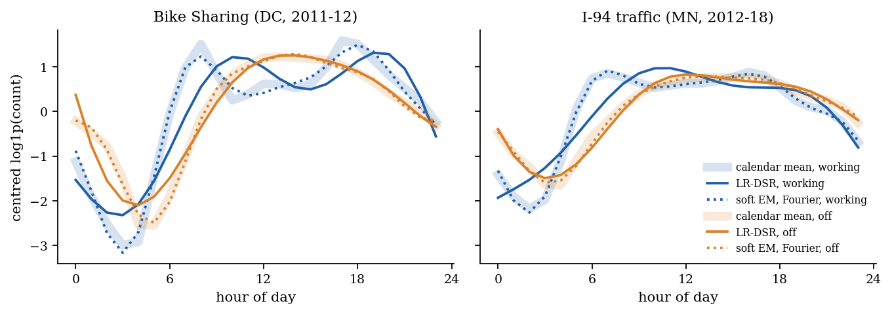

## 8. Days with sensor gaps

A third of the I-94 days (616) had been dropped for sensor gaps. A law does
not need a complete day: it is scored at the observed hours with the level as
a nuisance. Against the calendar, days with **6-11 observed hours** (38 days):
law 1.000, hour-mean imputation 0.868, linear imputation 0.711. The
controlled version (real gap masks on complete days, 111 masked days) agrees:
the law keeps its full-day decision 99.1% of the time, imputation
88.3% and 78.4%. Not a sweep: at 12-17 hours hour-mean imputation
edges it (0.980 vs 0.966).

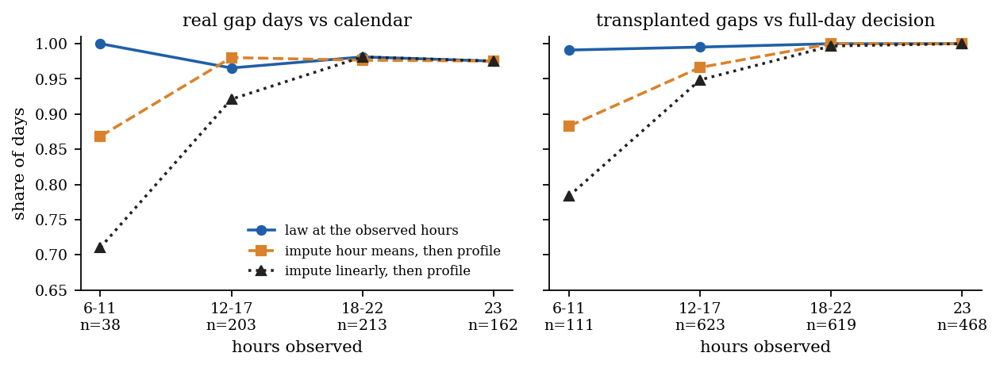

## 9. A partial day's error (V11)

For the classifier actually used, with correlated hours, the error of a day
observed at hours `H` is exact:
`Q((|g~_H|^2/2 +/- s^2 log(pi_1/pi_0)) / sqrt(g~_H^T Sigma_H g~_H))`.

- **Which hours matter, predicted:** removing a 6- or 12-hour block at each of
  the 24 start hours, predicted and observed errors rank the starts alike
  (Spearman 0.86-0.95); the worst start is named in 3/4 cases.
- **When a day is decided:** I-94 days are decided at 99% confidence by 5 am
  (0.990 predicted, 0.989 observed).
- **The level is not in band:** conservative mid-range (0.057 vs 0.018),
  optimistic in the far tail (0.0003 vs 0.0010).

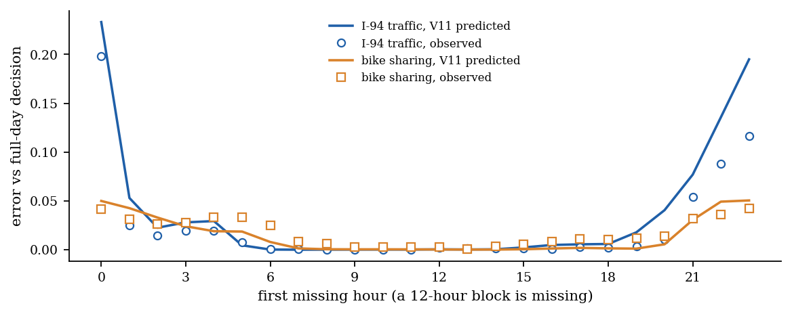
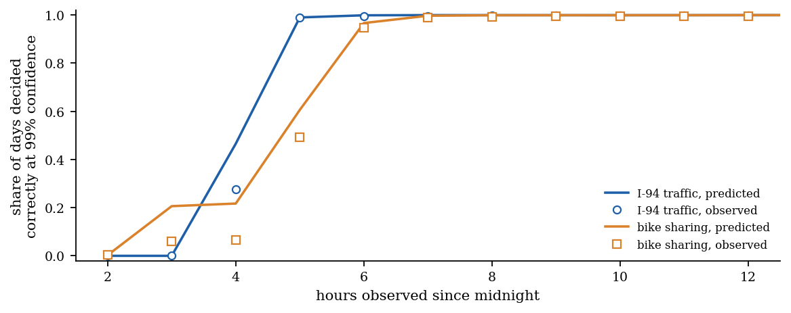

## 10. A kernel basis

Nystrom (RBF), random-Fourier, cosine and Legendre bases as drop-in
replacements for the term library. On mission 4's failure the gap outside
the span falls from 37% to 0.01%, and the gap to the oracle from
+0.096 to +0.051 (soft EM); over all twelve problems +0.018 to
+0.015. **Negative:** the rank is chosen without labels, and the rule the
tuning seeds picked (`snr_1se`, 0.0716 vs 0.0762) lost on the reporting seeds
(0.0722 vs 0.0701); the SNR variants are within seed noise of each other.
It is reported as chosen.

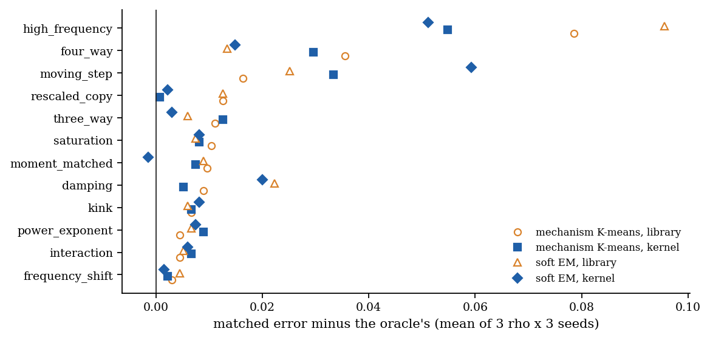

## 11. Classification: V10

A class is a set of laws: `LawClassifier` fits `L` laws per class with the
LR-DSR loop inside each class and scores windows of any design. Its
learning curve is a formula whose price is the **basis dimension `p`, not the
window length**. The exact three-scalar form is in band in 58/60
fixed-design cells; at a random design the estimated laws' inverse-Wishart
tail is computed exactly and 60/60 cells are in band, the 9 with
`p/(m n) > 0.2` included.

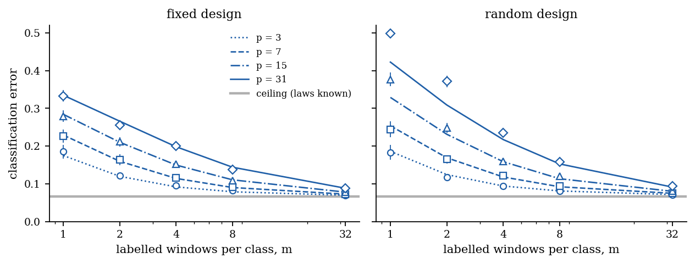

## 12. 24 UCR datasets

Nine daily-cycle and fifteen shape datasets, the archive's own splits,
hyperparameters by CV on the training split.

| | daily | shape |
|---|---|---|
| law classifier vs raw 1-NN (wins or ties) | 5/9 (0.171 vs 0.203) | 11/15 (0.140 vs 0.158) |
| law features vs raw, same SVM | 5/9 (0.153 vs 0.187) | 10/15 (0.126 vs 0.136) |
| best law vs best tuned raw classifier | 1/9 (0.162 vs 0.137) | 7/15 (0.130 vs 0.107) |

The law representation helps a fixed rule; a generative law classifier does
**not** beat the best tuned discriminative classifier on a full training set.
With few labels the gain is a point or two; scattered irregular sampling and
clustering are close to ties (linear interpolation handles short gaps well --
the edge of mission 8 is at *long* gaps).

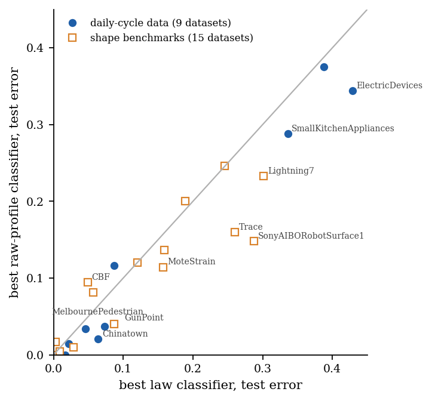

## 13. Repairs

- **Phase as a nuisance** (a law played early or late): shape-group error
  0.140 -> 0.128; GunPoint 0.087 -> 0.027, below DTW (0.087); TwoPatterns
  0.058 -> 0.008; Trace 0.260 -> 0.120. Still behind DTW on average (0.094),
  and CV on a few dozen series sometimes picks the wrong warp.
- **A discriminative head on laws:** daily-group error 0.171 -> 0.158
  against 0.137 for the best raw classifier -- part of the gap, not all;
  unstable on tiny many-class sets (FaceFour 0.159 -> 0.307).

## 14. Streaming with gaps

The online clusterer now takes ragged windows, a level nuisance and a kernel
basis. Every I-94 day streams in calendar order -- 1727 days, 573 partial --
and the partial days are sorted as well as the complete ones (96.3% vs
96.3%). A newcomer law the term library cannot represent is born in
3/3 streams at `rho` = 1 with a Nystrom basis and 0/3 with the library,
whose misfit inflates the noise the novelty test measures.

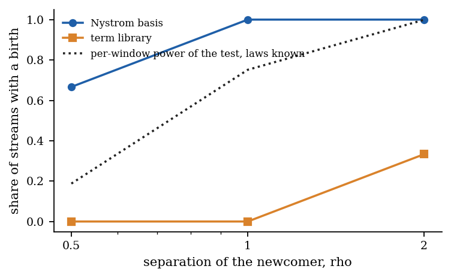

## 15. Wind power curves

Kelmarsh wind farm: 14626 six-hour turbine blocks, each with its own wind
speeds -- the method's home ground, where no raw profile exists and industry
bins each block's curve instead (a median block covers 7 of 24 bins).
The archive has **no operator labels** (checked), so blocks are scored
against physical proxies. On turbines never trained on (balanced error):

| proxy | law classifier | method of bins, best | V1 ceiling |
|---|---|---|---|
| cold vs warm | **0.305** | 0.351 | 0.193 |
| waked vs free | **0.353** | 0.406 | 0.269 |
| night vs day (negative control) | 0.423 | 0.426 | 0.374 |

The declared prediction that laws gain most on narrow wind-speed coverage
**held for temperature and failed for wake**. The cold/warm curve ratio
falls from 1.20 at low wind to 1.026 near rated, onto the air-density
prediction (1.032). Streamed turbine by turbine, 5 regimes are born
on 24-26 December 2016 on 5 turbines at once -- the storms of that Christmas.

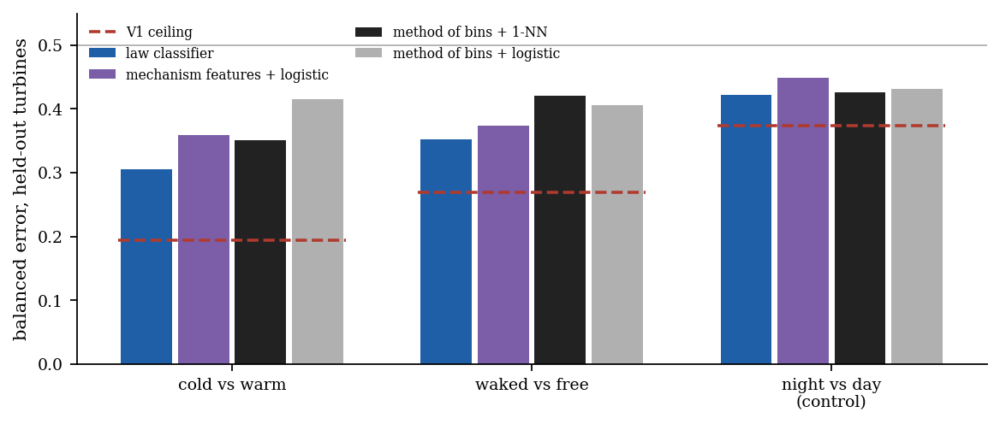
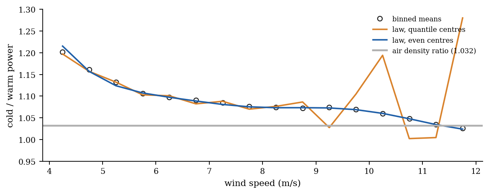

---

## What did not work

Kept here, not in footnotes:

- The loop does not improve on a good start (mission 3).
- On whole days with one shared design, a raw-profile K-means ties the method (7).
- Choosing `K` by BIC fails on real days (7).
- V11 ranks masks well but its absolute error level is off by a factor of a few (9).
- The rank rule chosen on the tuning seeds lost on the reporting seeds (10).
- A generative law classifier loses to the best tuned raw classifier (12); the
  repairs close part of the gap, not all, and misfire on tiny datasets (13).
- Sparse scattered sampling gives no systematic edge; only long gaps do (12).
- The declared coverage prediction failed for wake (15); unsupervised
  clusters of wind blocks match no physical proxy (15).

## Reproduce

```bash
pip install -e ".[dev]"
python -m experiments all          # every CSV in results/ (downloads ~0.5 GB of public data)
python -m analysis.plots           # every figure
python -m analysis.report --write  # README.md
python -m analysis.results         # this page
python notebooks/build.py          # eight executed notebooks
pytest -q
```
